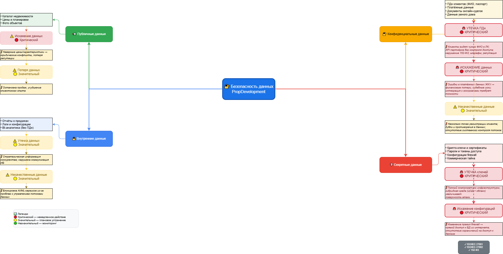

# 🔐 Проверочный лист по безопасности данных — PropDevelopment

> **Статус:** ✅ Готов к аудиту  
> **Версия:** 1.0  
> **Дата:** 2026  
> **Стандарты:** ISO/IEC 27001, ISO/IEC 27002, 152-ФЗ

---

## 🗺️ Визуализация

*Рисунок 1 — Классификация данных и риски по категориям*

---

## 📋 Описание

Документ содержит анализ безопасности данных строительной компании PropDevelopment...

### 📢 ПУБЛИЧНЫЕ ДАННЫЕ

**Примеры данных:**
- Каталог квартир и объектов недвижимости
- Цены, планировки, фотографии
- Общая информация о ЖК

**Риски:**

| Риск | Оценка | Обоснование |
|------|--------|-------------|
| **Искажение данных** | 🔴 Критический | Неверная информация о ценах или характеристиках объектов приведёт к юридическим конфликтам, потере репутации и финансовым потерям |
| **Потеря данных** | 🟡 Значительный | Потеря каталога недвижимости остановит продажи и ухудшит клиентский опыт |
| **Некачественные данные** | 🟡 Значительный | Устаревшие данные о доступности квартир приведут к недовольству клиентов и потере лидов |

---

### 🔒 ВНУТРЕННИЕ ДАННЫЕ

**Примеры данных:**
- Внутренние отчёты о продажах
- Логи приложений и конфигурации систем
- Аналитические данные (BI без ПДн)
- Метрики эффективности

**Риски:**

| Риск | Оценка | Обоснование |
|------|--------|-------------|
| **Утечка данных** | 🟡 Значительный | Раскрытие внутренней аналитики конкурентам даст им стратегическое преимущество |
| **Искажение данных** | 🟡 Значительный | Неверные отчёты приведут к ошибочным управленческим решениям |
| **Некачественные данные** | 🟡 Значительный | Проблемы с управлением потоками данных блокируют реализацию ML/AI сервисов |

---

### 🔐 КОНФИДЕНЦИАЛЬНЫЕ ДАННЫЕ

**Примеры данных:**
- ПДн клиентов (ФИО, телефон, email, паспорт, ИНН)
- Данные собственников (владельцы, история платежей)
- Платёжные данные (реквизиты, транзакции)
- Документы онлайн-сделок
- Данные умного дома

**Риски:**

| Риск | Оценка | Обоснование |
|------|--------|-------------|
| **Утечка данных** | 🔴 Критический | Клиенты видят чужие ФИО в личном кабинете. API партнёров без контроля доступа. Нарушение 152-ФЗ, штрафы, потеря репутации |
| **Потеря данных** | 🔴 Критический | Потеря персональных данных невозместима. Отсутствие системного контроля потоков данных создаёт риски |
| **Искажение данных** | 🔴 Критический | Ошибки в платёжных данных ЖКХ приведут к финансовым потерям клиентов и судебным искам |
| **Некачественные данные** | 🟡 Значительный | Несколько точек регистрации клиента без координации создают дубли и противоречия |

---

### 🛡️ СЕКРЕТНЫЕ ДАННЫЕ

**Примеры данных:**
- Криптографические ключи и SSL-сертификаты
- Пароли, токены доступа, секреты БД
- API-ключи внешних сервисов
- Конфигурации firewall

**Риски:**

| Риск | Оценка | Обоснование |
|------|--------|-------------|
| **Утечка данных** | 🔴 Критический | Компрометация ключей даст полный контроль над системами. Гибридная инфраструктура увеличивает поверхность атаки |
| **Потеря данных** | 🔴 Критический | Потеря криптографических ключей сделает невозможным расшифровку данных и парализует бизнес |
| **Искажение данных** | 🔴 Критический | Изменение конфигураций firewall откроет прямой доступ к БД из интернета |

---

## Матрица критических рисков

| Приоритет | Категория | Риск | Влияние |
|-----------|-----------|------|---------|
| **P0** | Конфиденциальные | Утечка ПДн | 🔴 Штрафы, репутация, суды |
| **P0** | Конфиденциальные | Искажение платёжных данных | 🔴 Финансовые потери |
| **P0** | Секретные | Утечка ключей | 🔴 Компрометация инфраструктуры |
| **P0** | Публичные | Искажение данных | 🔴 Юридические конфликты |