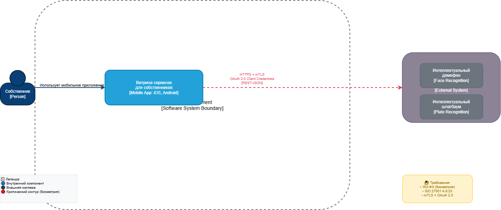
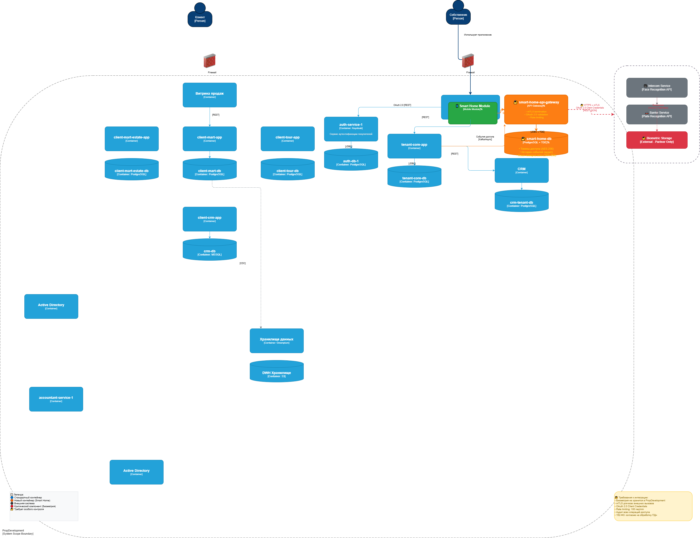

# Task 3: Интеграция сервисов «Умный дом» — PropDevelopment

**Статус:** ✅ Выполнено  
**Дата:** 2026  
**Автор:** Архитектор ПО

---

## 📋 Цель задачи

Подготовить архитектурные артефакты для интеграции новых сервисов «Умный дом» от партнёра:
- Интеллектуальный домофон (распознавание по лицу)
- Интеллектуальный шлагбаум (распознавание номеров автомобилей)

Сервисы должны быть доступны через текущее мобильное приложение собственников.

---

## 🗺️ Диаграммы C4

### Контекстная диаграмма (C4 Level 1)

**Ключевые элементы:**
| Элемент | Тип | Описание |
|---------|-----|----------|
| Собственник | Person | Пользователь мобильного приложения |
| Витрина сервисов для собственников | Mobile App | Точка входа для управления умным домом |
| Партнёр «Умный дом» | External System | Внешний провайдер сервисов домофона и шлагбаума |
| Интеллектуальный домофон | External Service | Распознавание лиц, управление доступом в подъезд |
| Интеллектуальный шлагбаум | External Service | Распознавание номеров, управление въездом |

> **Протокол взаимодействия:** HTTPS + mTLS, OAuth 2.0 Client Credentials

---

### Диаграмма контейнеров (C4 Level 2)

**Новые контейнеры в PropDevelopment:**

| Контейнер | Технология | Назначение |
|-----------|------------|------------|
| `smart-home-api-gateway` | Kong / Spring Cloud Gateway | Единая точка входа для интеграции с партнёром: mTLS, OAuth 2.0, rate limiting |
| `Smart Home Module` | Native iOS/Android SDK | Модуль в мобильном приложении для управления устройствами |
| `smart-home-db` | PostgreSQL + pgcrypto + TDE | Хранение токенов доступа, истории событий, хэшей номеров авто |

**Изменения в существующих контейнерах:**

| Контейнер | Изменение |
|-----------|-----------|
| `Витрина сервисов для собственников` | Добавлен Smart Home Module для управления устройствами |
| `tenant-core-app` | Интеграция с Smart Home Gateway для получения событий доступа |
| `auth-service-1` | Расширен для поддержки OAuth 2.0 flow для сервис-сервис аутентификации |

---

## 🔐 Требования к внешней интеграции

### 1. Требования к безопасности

| № | Требование | Приоритет | Обоснование |
|---|------------|-----------|-------------|
| SEC-01 | Все данные передаются только по HTTPS (TLS 1.3) | Критический | Защита от перехвата трафика, особенно для биометрических данных |
| SEC-02 | Взаимная аутентификация через mTLS (client certificates) | Критический | Гарантия подлинности обеих сторон интеграции |
| SEC-03 | Биометрические данные не хранятся в PropDevelopment | Критический | Соответствие 152-ФЗ, минимизация рисков утечки биометрии |
| SEC-04 | Шифрование чувствительных данных в БД (TDE + column-level encryption) | Критический | Защита токенов доступа, идентификаторов устройств |
| SEC-05 | Rate limiting на всех API endpoints (макс. 100 запросов/мин) | Высокий | Защита от DDoS и злоупотреблений |
| SEC-06 | Логирование всех операций доступа (кто, когда, какое устройство) | Высокий | Аудит и расследование инцидентов |
| SEC-07 | Запрет на передачу ПДн собственников партнёру без согласия | Критический | Соответствие 152-ФЗ, ст. 6-9 |
| SEC-08 | Сегментация сети: контур Smart Home изолирован от основных БД | Высокий | Минимизация поверхности атаки |
| SEC-09 | Регулярная ротация API-ключей и сертификатов (90 дней) | Высокий | Снижение рисков компрометации |
| SEC-10 | WAF перед Smart Home API | Высокий | Защита от OWASP Top 10 уязвимостей |

---

### 2. Протоколы аутентификации и авторизации

| Направление | Протокол | Описание |
|-------------|----------|----------|
| Мобильное приложение → PropDevelopment | OAuth 2.0 + OIDC | Существующий auth-service-1 (Keycloak), JWT токены |
| PropDevelopment → Партнёр «Умный дом» | OAuth 2.0 Client Credentials | Сервис-сервис аутентификация, access token с ограниченным scope |
| Партнёр → Устройства (домофон/шлагбаум) | Проприетарный протокол партнёра | Требуется документация от партнёра, изолированный контур |
| Внутренние сервисы PropDevelopment | mTLS + JWT | Взаимная аутентификация между контейнерами |

**Flow аутентификации:**
1. Собственник логинится в мобильном приложении → auth-service-1 (Keycloak)
2. Приложение получает JWT токен
3. При запросе на открытие двери: мобильное приложение → Smart Home Module
4. Smart Home Module → smart-home-api-gateway (внутренний вызов)
5. Gateway добавляет Partner Access Token (OAuth 2.0 Client Credentials)
6. Запрос → Партнёр «Умный дом» (HTTPS + mTLS)
7. Партнёр проверяет токен, выполняет распознавание, открывает устройство
8. Ответ возвращается по цепочке, событие логируется в smart-home-db

---

### 3. Организация взаимодействия между системами

#### 3.1 Архитектурные принципы

| Принцип | Описание |
|---------|----------|
| **API Gateway** | Все запросы к партнёру проходят через `smart-home-api-gateway` PropDevelopment |
| **Circuit Breaker** | Защита от каскадных сбоев при недоступности партнёра |
| **Async Communication** | События от устройств (открытие двери) через Kafka (асинхронно) |
| **Data Minimization** | Партнёр получает только минимально необходимые данные (ID собственника, номер квартиры) |
| **Fail-Safe** | При недоступности партнёра — доступ через резервные механизмы (ключи, коды) |

#### 3.2 Контракты API

| Endpoint | Метод | Описание | Данные запроса |
|----------|-------|----------|----------------|
| `/api/v1/smart-home/intercom/access` | POST | Запрос на открытие двери через домофон | `{ "ownerId", "buildingId", "timestamp" }` |
| `/api/v1/smart-home/barrier/access` | POST | Запрос на открытие шлагбаума | `{ "ownerId", "carPlate", "timestamp" }` |
| `/api/v1/smart-home/events` | GET | Получение истории событий доступа | `{ "from", "to", "limit" }` |
| `/api/v1/smart-home/devices` | GET | Список устройств собственника | `{ "ownerId" }` |
| `/api/v1/smart-home/webhook` | POST | Webhook от партнёра о событиях | `{ "eventType", "deviceId", "timestamp", "status" }` |

#### 3.3 Обработка данных

| Тип данных | Где хранится | Кто имеет доступ | Шифрование |
|------------|--------------|------------------|------------|
| Биометрические шаблоны лиц | У партнёра | Только партнёр | AES-256 (у партнёра) |
| Номера автомобилей | У партнёра + smart-home-db (хэш) | PropDevelopment (хэш), Партнёр (полные) | SHA-256 хэш + AES-256 |
| Токены доступа | smart-home-db | tenant-core-app, smart-home-gateway | AES-256 + TDE |
| История открытий | smart-home-db + у партнёра | Собственник, УК, BI (агрегировано) | AES-256 |
| ПДн собственников | crm-tenant-db | Только PropDevelopment | AES-256 + TDE |

#### 3.4 Мониторинг и алертинг

| Метрика | Порог | Действие |
|---------|-------|----------|
| Ошибка аутентификации партнёра | >5 за 5 минут | Блокировка интеграции, алерт ИБ |
| Время ответа партнёра | >3 секунды | Circuit breaker, алерт DevOps |
| Неудачные попытки доступа | >10 за минуту для одного устройства | Алерт ИБ, возможная атака |
| Расхождение событий | >1% между PropDevelopment и партнёром | Аудит данных, алерт Data Team |

---

## 📁 Структура файлов Task3

Task3/
├── README.md # Этот файл
├── context-diagram.drawio.png # Контекстная диаграмма (изображение)
├── context-diagram.drawio.xml # Контекстная диаграмма (исходник draw.io)
├── container-diagram.drawio.png # Диаграмма контейнеров (изображение)
└── container-diagram.drawio.xml # Диаграмма контейнеров (исходник draw.io)

---

## ✅ Чек-лист для внедрения

| Этап | Задача | Ответственный | Статус |
|------|--------|---------------|--------|
| 1 | Согласование контрактов API с партнёром | Архитектор + ИБ | ⬜ |
| 2 | Настройка mTLS сертификатов | DevOps | ⬜ |
| 3 | Разработка Smart Home модуля в мобильном приложении | Mobile Team | ⬜ |
| 4 | Создание smart-home-db с шифрованием | Backend Team | ⬜ |
| 5 | Настройка API Gateway и rate limiting | DevOps | ⬜ |
| 6 | Тестирование безопасности интеграции (pentest) | ИБ + Подрядчик | ⬜ |
| 7 | Обучение сотрудников поддержке новых сервисов | Операционная команда | ⬜ |
| 8 | Документирование для 152-ФЗ (обработка биометрии) | ИБ + Юристы | ⬜ |

---

## 🔗 Соответствие стандартам

| Стандарт | Контроль | Реализация в решении |
|----------|----------|---------------------|
| **152-ФЗ** | Обработка биометрических ПДн | Биометрия хранится только у партнёра, в PropDevelopment — только хэши и токены |
| **152-ФЗ** | Согласие на обработку ПДн | Мобильное приложение запрашивает явное согласие перед активацией сервисов |
| **ISO 27001 A.8.23** | Управление секретами | HashiCorp Vault для хранения API-ключей и сертификатов |
| **ISO 27001 A.8.19** | Безопасность сетей | Сегментация сети, mTLS для внешних вызовов |
| **ISO 27001 A.8.12** | Предотвращение утечек | DLP-правила для smart-home-db, аудит доступа |
| **OWASP API Security** | Защита API | Rate limiting, валидация входных данных, JWT validation |

---

> **Примечание:** Все диаграммы созданы в draw.io и готовы к редактированию. Для открытия используйте: File → Import from → Device → выбрать соответствующий `.drawio.xml` файл.

